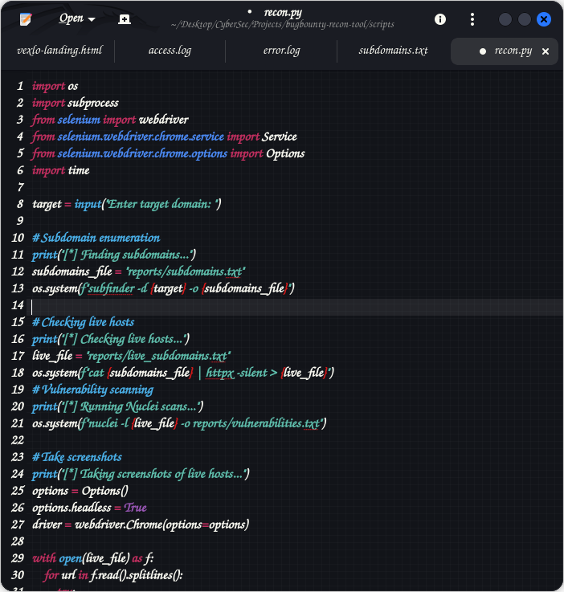

# Automated Bug Bounty Recon Tool

## Overview

The Automated Bug Bounty Recon Tool is a Python-based reconnaissance automation script designed to streamline the early stages of penetration testing and bug bounty hunting.

The tool automates multiple reconnaissance tasks including:

- Subdomain discovery
- Live host detection
- Vulnerability scanning
- Automated website screenshot capture

This project demonstrates how common offensive security tools can be integrated into a single workflow to simulate the initial reconnaissance phase used by penetration testers and bug bounty hunters.

---

## Objectives
The main objective of this project is to demonstrate practical offensive cybersecurity skills by automating a reconnaissance pipeline commonly used in bug bounty programs and security assessments.

Key goals include:

- Automating reconnaissance processes
- Integrating multiple security tools
- Generating structured reports
- Demonstrating scripting and security workflow automation

---

## Features
- Automated subdomain discovery
- Live host detection
- Vulnerability scanning
- Automated screenshots of discovered websites
- Structured output reports
- Simple command-line interface
- Modular design for future expansion

---

## Tools and Technologies Used
This project integrates several well-known offensive security tools and technologies:

- Python – scripting and automation
- Subfinder – subdomain discovery
- httpx – probing and detecting live web servers
- Nuclei – vulnerability scanning
- Selenium – browser automation
- ChromeDriver – headless browser control

These tools are widely used in the cybersecurity industry during reconnaissance and vulnerability discovery phases.

---

## Project Structure
bugbounty-recon-tool
│
├── scripts
│ └── recon.py
│
├── reports
│ ├── subdomains.txt
│ ├── live_subdomains.txt
│ └── vulnerabilities.txt
│
├── screenshots
│ └── *.png
│
└── README.md

Description of folders:

scripts  
Contains the main reconnaissance automation script.

reports  
Stores generated output including discovered subdomains, live hosts, and detected vulnerabilities.

screenshots  
Contains screenshots of live websites discovered during scanning.

README.md  
Project documentation.

---

## How the Tool Works

The tool performs reconnaissance in four automated stages.

### 1. Subdomain Enumeration

The tool first discovers subdomains associated with a target domain using Subfinder.

Example:

subfinder -d example.com

This step identifies potential attack surfaces hosted under the target domain.

---

### 2. Live Host Discovery

After subdomain enumeration, the tool checks which discovered domains are active using httpx.

Example:

httpx -l subdomains.txt

This step filters out inactive domains and focuses only on reachable web services.

---

### 3. Vulnerability Scanning

Live hosts are scanned using Nuclei to identify potential vulnerabilities based on pre-built security templates.

Example:

nuclei -l live_subdomains.txt

Nuclei can detect issues such as:

- misconfigurations
- exposed services
- outdated technologies
- known vulnerabilities

---

### 4. Website Screenshot Capture

Finally, the tool uses Selenium with a headless browser to automatically visit each live host and capture screenshots.

This allows quick visual inspection of discovered web applications.

---

## Installation

### Prerequisites

Before running the tool, install the following dependencies.

Python 3.10 or later is recommended.

Install Python packages:

pip install selenium pandas (You might need to create a virtual environment and activate it)

Install required reconnaissance tools:

Linux (Debian/Ubuntu/Kali)

sudo apt update
sudo apt install subfinder httpx nuclei chromium-chromedriver

Verify installation:

subfinder -version
httpx -version
nuclei -version
chromedriver --version

---

## Usage

Run the reconnaissance script using Python.

python3 scripts/recon.py

You will be prompted to enter a target domain.

Example:

Enter target domain: example.com

The tool will automatically execute all reconnaissance stages and store the results in the reports and screenshots directories.

---

## Example Output

After execution, the project generates several outputs.

reports/subdomains.txt  
Contains all discovered subdomains.

reports/live_subdomains.txt  
Contains only reachable web services.

reports/vulnerabilities.txt  
Lists potential vulnerabilities detected by the scanner.

screenshots/*.png  
Screenshots of discovered live websites.

These outputs help security analysts quickly identify potential attack surfaces.

---

## Example Workflow

1. User enters target domain
2. Tool enumerates subdomains
3. Live domains are filtered
4. Vulnerability scanner analyzes targets
5. Screenshots are generated
6. Results are saved for further analysis

---

## Future Improvements

Planned enhancements include:

- HTML report generation
- CSV export for vulnerability results
- multi-domain scanning support
- improved error handling
- parallel scanning for faster execution
- integration with additional reconnaissance tools
- automated technology fingerprinting

---

## Learning Outcomes

This project demonstrates skills in:

- cybersecurity reconnaissance
- offensive security workflow automation
- Python scripting
- integrating external security tools
- vulnerability scanning processes
- security reporting and documentation

---

## Security and Ethical Use Disclaimer

This tool is intended strictly for educational purposes and authorized security testing.

Users must only run this tool against:

- systems they own
- systems they have explicit permission to test

Unauthorized scanning or testing of systems may be illegal and unethical.

The developer assumes no responsibility for misuse of this software.

---

## Author

Mohan Otieno

Cybersecurity and software engineering enthusiast interested in offensive security, automation, and vulnerability research.

GitHub: https://github.com/mohanot

---

## Licence
You are free to use, modify, and distribute this software with proper attribution.
